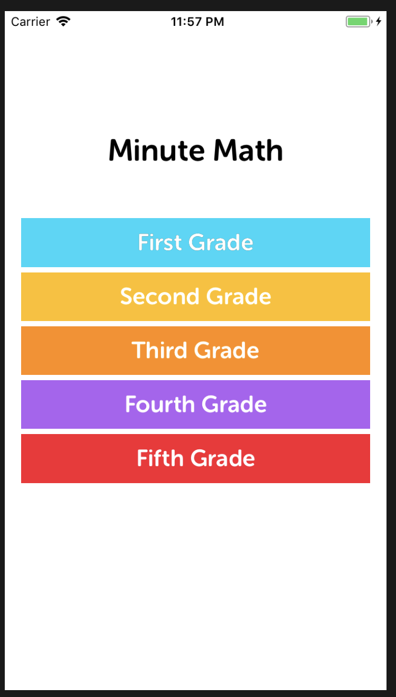
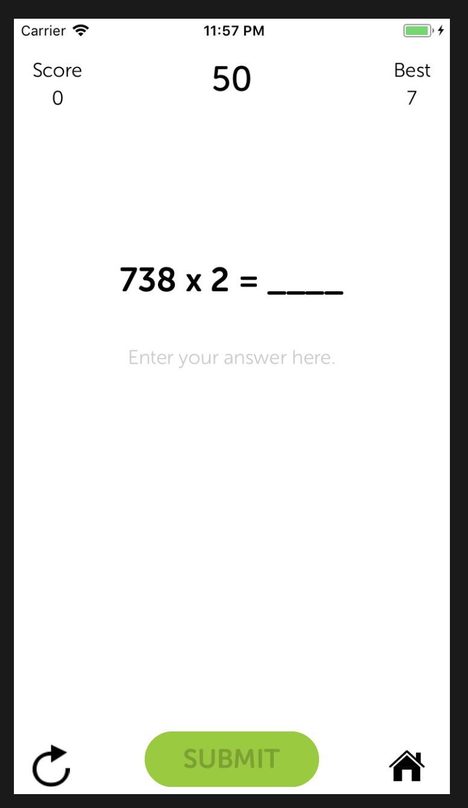
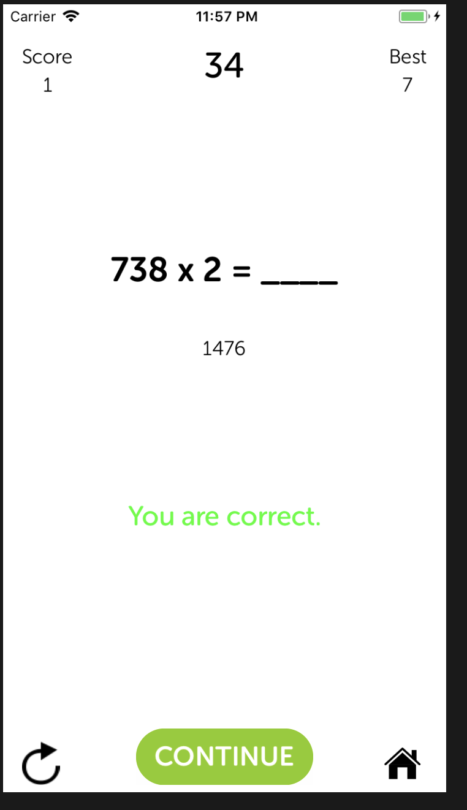
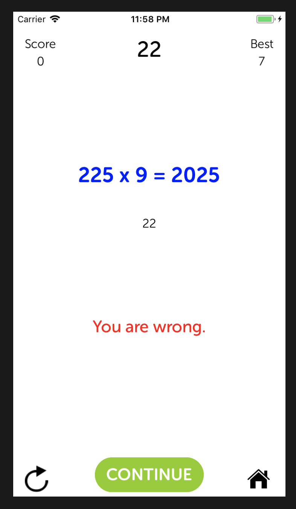
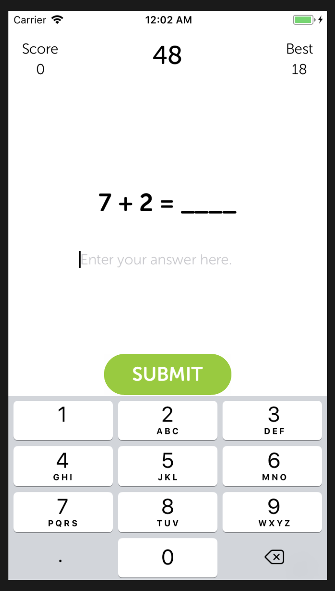
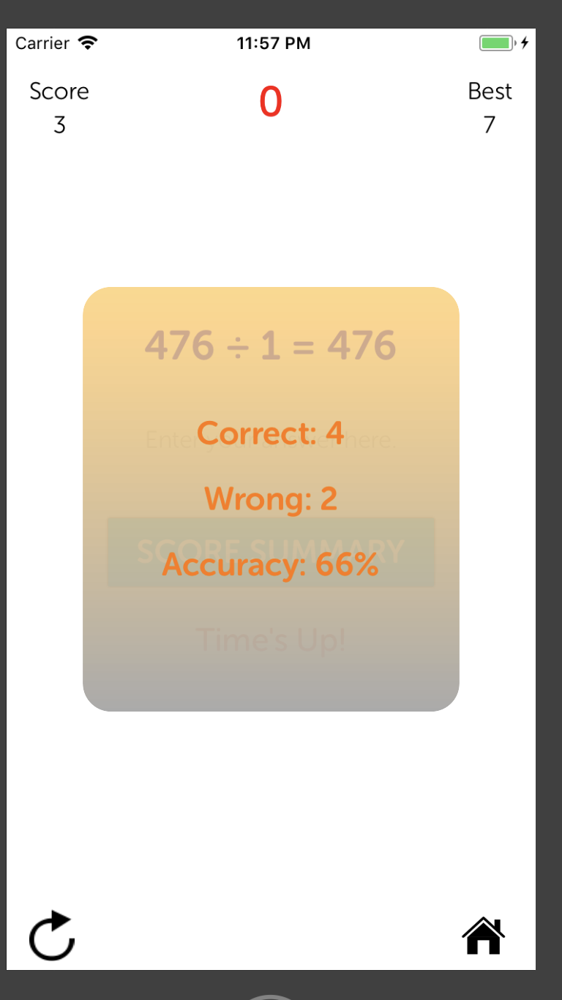

# Minute-Math

### Description
"Minute Math" is an iOS math game for elementary school students. There are five levels: 1st through 5th grade. Math problems are randomly generated for the appropriate grade level.

The goal is to see how many math problems you can solve in one minute. This game is good practice for students who want to improve their mental math skills.

How the game is scored: a correct answer gives you one point. A wrong answer deducts one point (so that there's a penalty for lower accuracy).

     

     

     
